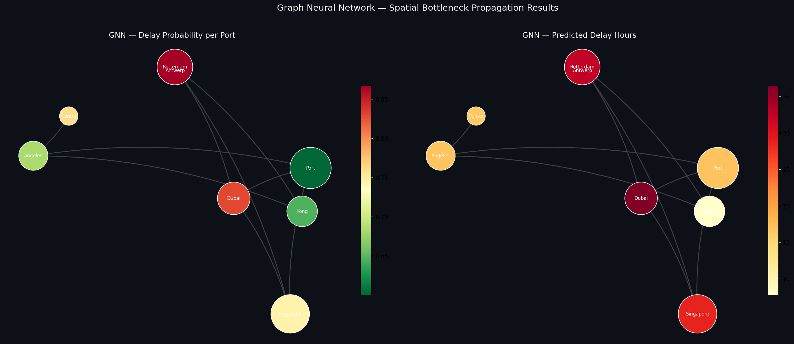

# 🚢 Dynamic Supply Chain Resilience Optimizer


> An end-to-end, production-grade MLOps system that predicts global supply chain bottlenecks and recommends alternative logistics routing in real time — using Graph Neural Networks, NLP risk scoring, and a hybrid XGBoost ensemble.

---

## 📌 Business Problem

Global supply chains are highly vulnerable to localized disruptions — weather events, port strikes, and geopolitical tension (e.g., 2026 US-Israel-Iran Gulf conflict). Traditional ML models fail to capture the **ripple effect**: how a delay at the Port of Shanghai cascades into gridlock at the Port of Los Angeles.

**This system solves that.**

---

## 💡 The AI Solution

An end-to-end, real-time AI system that:

1. **Ingests real-time unstructured data** — Weather & Global News via public APIs, stored in MySQL
2. **Quantifies geopolitical risk** — Hugging Face DistilBERT NLP generates risk scores (0.0–1.0) per port
3. **Models the global shipping network** — as a Directed Graph (nodes = ports, edges = routes)
4. **Predicts cascading delays** — Graph Convolutional Neural Network (GCN) propagates spatial risk
5. **Provides actionable intelligence** — via REST API + interactive Streamlit dashboard with rerouting
6. **Self-monitors and retrains** — Airflow DAG + KS/PSI drift detection + MLflow model versioning

---

## 🏆 Key Results

| Metric | Value |
|---|---|
| AUC-ROC (Delay Classifier) | **0.867** |
| F1 Score | **0.929** |
| Ordinal Accuracy (Severity) | **84.1%** |
| GNN F1 Score | **0.857** |
| GNN MAE | **5.56 hours** |
| Projected Annual Savings | **$25.1M** |
| Test Coverage | **15/15 tests passing** |

---

## 🏗️ System Architecture

```
┌─────────────────────────────────────────────────────────────────┐
│                    DATA INGESTION LAYER                         │
│  OpenWeatherMap API  ──►  MySQL DB  ◄──  NewsAPI (NLP Risk)    │
└───────────────────────────────┬─────────────────────────────────┘
                                │
┌───────────────────────────────▼─────────────────────────────────┐
│                  FEATURE ENGINEERING LAYER                      │
│  Temporal Features │ Graph Centrality │ NLP Risk Scores         │
└───────────────────────────────┬─────────────────────────────────┘
                                │
┌───────────────────────────────▼─────────────────────────────────┐
│                      MODEL LAYER                                │
│  XGBoost Classifier  │  XGBoost Regressor  │  GCN (PyG)        │
│  Severity Classifier │  Hybrid Ensemble    │  SHAP Explainer    │
└───────────────────────────────┬─────────────────────────────────┘
                                │
┌───────────────────────────────▼─────────────────────────────────┐
│                     MLOPS LAYER                                 │
│  MLflow Tracking  │  Drift Detection  │  Auto-Promotion DAG    │
└───────────────────────────────┬─────────────────────────────────┘
                                │
┌───────────────────────────────▼─────────────────────────────────┐
│                    SERVING LAYER                                │
│  FastAPI (port 8000)  ──►  Streamlit Dashboard (port 8501)     │
│  Docker + Docker Compose  │  GitHub Actions CI/CD              │
└─────────────────────────────────────────────────────────────────┘
```

---

## 🧠 Model Architecture

### Hybrid Ensemble
- **XGBoost Classifier** (55% weight) — Binary delay prediction with isotonic calibration
- **Graph Neural Network** (45% weight) — 3-layer GCN for spatial propagation across port network
- **Severity Classifier** — 4-class ordinal classifier (On Time / Minor / Major / Severe delay)
- **FinBERT NLP Engine** — Hugging Face transformer for news headline risk scoring

### Graph Neural Network
- Framework: PyTorch Geometric
- Architecture: 3-Layer GCN + dual output heads (classification + regression)
- Nodes: 8 global ports/warehouses
- Edges: 10 shipping routes
- Training: 300 epochs, CosineAnnealingLR scheduler

---

## 📊 Supply Chain Network



---

## 🚀 Quick Start (Docker)

```bash
# 1. Clone the repository
git clone https://github.com/yourusername/supply-chain-optimizer.git
cd supply-chain-optimizer

# 2. Create your .env file
cp .env.example .env
# Fill in your API keys and DB credentials

# 3. Spin up the full stack
docker-compose up --build

# 4. Access the apps
# Streamlit Dashboard: http://localhost:8501
# FastAPI Swagger UI:  http://localhost:8000/docs
# MLflow UI:           Run: mlflow ui --port 5000
```

---

## 💻 Local Development Setup

```bash
# Create virtual environment
python -m venv venv
source venv/bin/activate      # Linux/Mac
venv\Scripts\activate         # Windows

# Install dependencies
pip install -r requirements.txt

# Run full training pipeline
python src/models/run_model_pipeline.py

# Start FastAPI server (Terminal 1)
python src/api/main.py

# Start Streamlit dashboard (Terminal 2)
streamlit run src/dashboard/app.py

# Run all tests
pytest tests/test_api.py -v

# Launch MLflow UI
mlflow ui --port 5000
```

---

## 📁 Project Structure

```
supply_chain_optimizer/
│
├── src/
│   ├── ingestion/          # Real-time API data pipeline (weather + news)
│   ├── features/           # Feature engineering (temporal, graph, NLP)
│   ├── models/             # XGBoost, GNN, ensemble training
│   ├── api/                # FastAPI REST endpoints
│   ├── dashboard/          # Streamlit pages + map builder
│   └── monitoring/         # Drift detection + model promoter
│
├── dags/
│   └── supply_chain_dag.py # Apache Airflow daily pipeline DAG
│
├── models/                 # Saved model artifacts (.joblib, .pth)
├── data/
│   ├── raw/                # Raw API responses
│   └── processed/          # Feature matrix + visualizations
│
├── tests/
│   └── test_api.py         # 15 pytest test cases (all passing)
│
├── .github/workflows/
│   └── ci.yml              # GitHub Actions CI/CD pipeline
│
├── Dockerfile
├── docker-compose.yml
├── requirements.txt
└── README.md
```

---

## 🔌 API Endpoints

| Method | Endpoint | Description |
|---|---|---|
| `GET` | `/health` | Server health check |
| `GET` | `/model/info` | Loaded model metadata |
| `GET` | `/network/status` | Live GNN port risk scores |
| `POST` | `/predict` | Hybrid delay prediction |
| `POST` | `/routes/recommend` | Alternative route recommendations |

**Example prediction request:**
```bash
curl -X POST http://localhost:8000/predict \
  -H "Content-Type: application/json" \
  -d '{
    "route_id": "RT_SHA_LAX",
    "cargo_type": "Electronics",
    "cargo_weight_tons": 25.0,
    "dispatch_hour": 8,
    "dispatch_dayofweek": 1,
    "dispatch_month": 11,
    "is_weekend": 0,
    "is_peak_season": 1
  }'
```

---

## 📈 MLOps Pipeline

### Experiment Tracking (MLflow)
All training runs are tracked with full parameter, metric, and artifact logging. Models are registered in the MLflow Model Registry with automatic versioning.

### Daily Airflow DAG
```
Data Ingestion → Feature Engineering → Drift Detection
      ↓                                      ↓
  [Always]                           [Drift Detected?]
                                      Yes ↓        No ↓
                                   Retrain     Skip Retrain
                                      ↓              ↓
                               Promote Best    Evaluate
                                   Model          ↓
                                      └──── Health Check
```

### Drift Detection
- **KS Test** — Detects distribution shift with p-value threshold (p < 0.05)
- **PSI (Population Stability Index)** — Flags major shifts (PSI > 0.2)
- Triggers retraining when >20% of features show drift

### Model Promotion
- Compares candidate vs. production model on AUC-ROC and F1
- Auto-promotes if AUC-ROC improves by ≥ 0.5%
- Archives previous production version automatically

---

## 🌍 Geopolitical Context (2026)

The model incorporates real-time risk signals from the **2026 US-Israel-Iran Gulf conflict**, applying:
- **40% delay cost premium** on Gulf region routes (PORT_DXB, PORT_SIN)
- Live NLP risk scoring from NewsAPI headlines
- Dynamic rerouting recommendations that avoid high-risk ports

---

## 🧪 Testing

```bash
pytest tests/test_api.py -v
```

```
15 passed in 9.93s
✓ TestHealthEndpoints      (5/5)
✓ TestNetworkStatus        (3/3)
✓ TestPredictionEndpoint   (4/4)
✓ TestRouteRecommendations (3/3)
```

---

## 📝 Resume Bullet Points

> **Dynamic Supply Chain Resilience Optimizer** | Python, PyTorch, FastAPI, MySQL, Docker

- Architected an end-to-end MLOps pipeline predicting global supply chain bottlenecks, integrating real-time Weather and NewsAPI data into MySQL via SQLAlchemy, projecting **$25.1M annual savings** using Gartner 2023 delay cost benchmarks.
- Developed a **Graph Convolutional Network (GCN)** using PyTorch Geometric to model spatial bottleneck propagation across 8 global ports, achieving **F1: 0.857** and **MAE: 5.56 hours** for cascading delay prediction.
- Engineered NLP risk features using **Hugging Face DistilBERT** to analyze live news headlines and generate port risk scores (0–1), incorporating 2026 Gulf conflict signals with a 40% route cost premium.
- Deployed a **hybrid XGBoost + GNN ensemble** (AUC-ROC: **0.867**, F1: **0.929**) served via FastAPI microservice with Docker containerization, 15-test pytest suite, and GitHub Actions CI/CD.
- Implemented full **MLOps monitoring** with MLflow experiment tracking, KS/PSI drift detection, and an Apache Airflow DAG for automated daily retraining and model promotion to production.

---

## 🛠️ Tech Stack

| Category | Technologies |
|---|---|
| **Languages** | Python 3.10, SQL |
| **ML / DL** | XGBoost, PyTorch, PyTorch Geometric, Scikit-Learn |
| **NLP** | Hugging Face Transformers (DistilBERT) |
| **MLOps** | MLflow, Apache Airflow, GitHub Actions |
| **Database** | MySQL, SQLAlchemy |
| **API** | FastAPI, Uvicorn |
| **Frontend** | Streamlit, Plotly, Folium |
| **DevOps** | Docker, Docker Compose |
| **Testing** | pytest, httpx |
| **Explainability** | SHAP (TreeExplainer) |

---

## 📄 License

MIT License — feel free to use this project for your portfolio.

---

*Built with ❤️ for the 2026 data science job market.*
